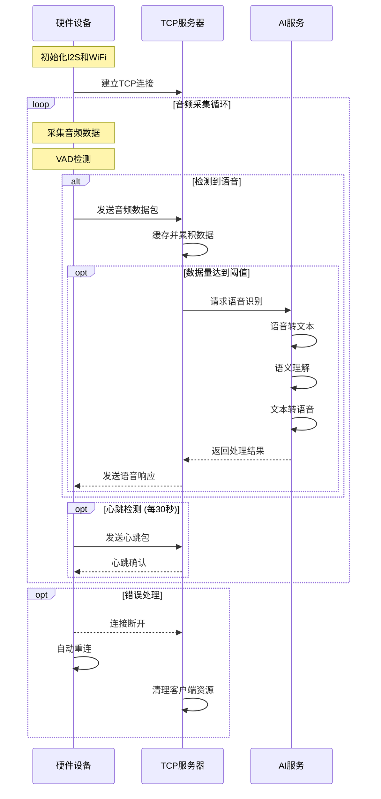

# 语音系统架构设计

## 系统架构图

```
+------------------------+     +------------------------+     +------------------------+
|      硬件设备层        |     |      TCP服务器层       |     |      AI服务层         |
+------------------------+     +------------------------+     +------------------------+
|                        |     |                        |     |                        |
| +------------------+   |     | +------------------+   |     | +------------------+   |
| |    音频采集      |   |     | |   客户端管理     |   |     | |   语音识别      |   |
| +------------------+   |     | +------------------+   |     | +------------------+   |
|          |            |     |          |            |     |          |            |
| +------------------+   |     | +------------------+   |     | +------------------+   |
| |    VAD检测      |   |     | |   数据缓存      |   |     | |   语义理解      |   |
| +------------------+   |     | +------------------+   |     | +------------------+   |
|          |            |     |          |            |     |          |            |
| +------------------+   |     | +------------------+   |     | +------------------+   |
| |   TCP客户端     |   |     | |   AI接口调用    |   |     | |   语音合成      |   |
| +------------------+   |     | +------------------+   |     | +------------------+   |
|          |            |     |          |            |     |          |            |
+----------|------------+     +----------|------------+     +----------|------------+
           |                           |                             |
           |                           |                             |
           +---------------------------+-----------------------------+
                                      |
                                      v
                               数据流动和处理

```

## 交互时序图



## ASCII 交互时序图（增强版）

```
硬件设备                TCP服务器                  AI服务
    |                      |                      |
    |                      |                      |
    |  初始化I2S和WiFi     |                      |
    |  [检查WiFi状态]      |                      |
    |                      |                      |
    |  连接请求 + 重试     |                      |
    |--------------------->|                      |
    |  连接确认 + 状态     |                      |
    |<---------------------|                      |
    |                      |                      |
    |     循环开始         |                      |
    |===========================================> |
    |                      |                      |
    |   采集音频数据       |                      |
    |   [16KHz采样]        |                      |
    |   [缓冲区管理]       |                      |
    |                      |                      |
    |   VAD语音检测        |                      |
    |   [能量检测法]       |                      |
    |   [连续性保证]       |                      |
    |                      |                      |
    |  检测到语音时:       |                      |
    |   [数据打包]         |                      |
    |   [序列号生成]       |                      |
    |                      |                      |
    |   发送音频数据包     |                      |
    |   [带序列号]         |                      |
    |--------------------->|                      |
    |   ACK + 序列号       |                      |
    |<---------------------|                      |
    |                      |                      |
    |   [超时重传]         |                      |
    |   最大重试3次        |                      |
    |                      |                      |
    |                      |  缓存音频数据        |
    |                      |  [累积至阈值]        |
    |                      |  [序列号校验]        |
    |                      |  [丢包处理]          |
    |                      |                      |
    |                      |  请求语音识别        |
    |                      |--------------------->|
    |                      |  [设置超时3秒]       |
    |                      |                      |
    |                      |                      |语音转文本
    |                      |                      |[Azure Speech]
    |                      |                      |
    |                      |                      |语义理解
    |                      |                      |[GPT-4]
    |                      |                      |
    |                      |                      |文本转语音
    |                      |                      |[Azure TTS]
    |                      |                      |
    |                      |   返回处理结果       |
    |                      |<---------------------|
    |                      |                      |
    |                      |   [超时或失败]       |
    |                      |   [降级处理]         |
    |                      |   [本地缓存]         |
    |                      |   [错误重试]         |
    |                      |                      |
    |   发送语音响应       |                      |
    |<---------------------|                      |
    |                      |                      |
    |                      |                      |
    |   心跳检测包         |                      |
    |--------------------->|                      |
    |   [每30秒]           |                      |
    |   [失败计数]         |                      |
    |                      |                      |
    |   心跳确认           |                      |
    |<---------------------|                      |
    |   [超时3次重试]      |                      |
    |                      |                      |
    |   错误处理:          |                      |
    |   连接断开时         |                      |
    |   [资源清理]         |                      |
    |   [状态保存]         |                      |
    |   [自动重连]         |                      |
    |                      |                      |
    |   重新建立连接       |                      |
    |   [恢复状态]         |                      |
    |--------------------->|                      |
    |                      |                      |
    |                      |  清理客户端资源      |
    |                      |  [释放缓存]          |
    |                      |  [保存状态]          |
    |                      |                      |
    |     循环结束         |                      |
    |===========================================> |
    |                      |                      |
```

### 可靠性保证机制

1. **连接管理**
   - TCP连接建立确认
   - 连接失败自动重试
   - WiFi状态实时监控
   - 状态恢复机制

2. **数据传输可靠性**
   - 数据包序列号
   - ACK确认机制
   - 超时重传（最大3次）
   - 丢包检测和处理

3. **音频处理保证**
   - 缓冲区溢出处理
   - VAD检测连续性
   - 采样补偿机制
   - 数据完整性校验

4. **心跳机制增强**
   - 失败计数器
   - 最大重试次数（3次）
   - 超时时间设置
   - 状态同步

5. **异常处理机制**
   - 资源自动清理
   - 状态定期保存
   - 优雅降级策略
   - 错误恢复流程

6. **服务质量保证**
   - AI服务超时处理（3秒）
   - 服务降级方案
   - 本地缓存备份
   - 错误重试策略

## 组件交互流程

### 1. 硬件设备层 (device.cpp)
- 通过I2S接口采集音频数据
- 使用VAD算法检测语音活动
- 将音频数据打包并通过TCP发送到服务器
- 维护与服务器的心跳连接
- 处理服务器返回的合成语音

### 2. TCP服务器层 (server.js)
- 管理多个硬件设备的连接
- 接收和缓存音频数据
- 验证数据包的完整性和序列
- 将完整的语音片段发送到AI服务
- 将AI服务的响应返回给硬件设备

### 3. AI服务层 (ai_service.js)
- 提供语音识别服务 (Azure Speech Services)
- 进行语义理解处理 (OpenAI GPT-4)
- 生成语音回复 (Azure Speech Services)
- 处理错误和异常情况

## 数据流说明

1. **音频采集流程**
   ```
   硬件设备 
   -> 音频采集(16KHz, 16bit) 
   -> VAD检测 
   -> TCP打包发送
   ```

2. **服务器处理流程**
   ```
   TCP服务器 
   -> 数据接收和缓存 
   -> 包完整性检查 
   -> 转发至AI服务
   ```

3. **AI处理流程**
   ```
   AI服务 
   -> 语音识别 
   -> 语义理解 
   -> 生成回复 
   -> 语音合成 
   -> 返回音频
   ```

## 关键技术参数

1. **音频参数**
   - 采样率：16KHz
   - 位深度：16bit
   | 通道数：单通道
   - 编码格式：PCM

2. **网络参数**
   - TCP端口：8080
   - 心跳间隔：30秒
   - 缓冲区大小：32KB
   - 包大小限制：4KB

3. **AI服务参数**
   - 语音识别延迟：<1s
   - 语义理解超时：3s
   - 语音合成质量：16KHz

## 错误处理机制

1. **网络异常处理**
   - 自动重连机制
   - 心跳检测
   - 数据包重传

2. **服务异常处理**
   - 服务降级策略
   - 错误日志记录
   - 异常状态恢复

3. **资源管理**
   - 内存使用监控
   - 连接数限制
   - 缓存清理策略

## 部署要求

1. **硬件要求**
   - ESP32或更高性能MCU
   - 至少4MB RAM
   - 支持I2S接口

2. **服务器要求**
   - Node.js v14+
   - 2GB以上内存
   - 支持HTTPS

3. **网络要求**
   - 稳定的网络连接
   - 低延迟(<100ms)
   - 足够带宽(>1Mbps)

### 硬件语音实现指南

#### 多语言实现支持

1. **MicroPython 实现**
```python
# ESP32 MicroPython 示例
from machine import I2S, Pin
import time

# I2S 配置
I2S_ID = 0
SAMPLE_RATE = 16000
BITS = 16
FORMAT = I2S.MONO
BUFFER_LENGTH = 1024

# 初始化 I2S
i2s = I2S(
    I2S_ID,
    sck=Pin(2),
    ws=Pin(15),
    sd=Pin(13),
    mode=I2S.RX,
    bits=BITS,
    format=FORMAT,
    rate=SAMPLE_RATE,
    ibuf=BUFFER_LENGTH
)

def collect_audio():
    audio_data = bytearray(BUFFER_LENGTH)
    num_read = i2s.readinto(audio_data)
    return audio_data[:num_read]
```

2. **Arduino 实现**
```cpp
// ESP32 Arduino 示例
#include <WiFi.h>
#include <driver/i2s.h>

const int SAMPLE_RATE = 16000;
const int BITS_PER_SAMPLE = 16;
const int BUFFER_SIZE = 1024;

void setup() {
  i2s_config_t i2s_config = {
    .mode = (i2s_mode_t)(I2S_MODE_MASTER | I2S_MODE_RX),
    .sample_rate = SAMPLE_RATE,
    .bits_per_sample = I2S_BITS_PER_SAMPLE_16BIT,
    .channel_format = I2S_CHANNEL_FMT_ONLY_LEFT,
    .communication_format = I2S_COMM_FORMAT_STAND_I2S,
    .intr_alloc_flags = ESP_INTR_FLAG_LEVEL1,
    .dma_buf_count = 8,
    .dma_buf_len = 64,
    .use_apll = false
  };
  i2s_driver_install(I2S_NUM_0, &i2s_config, 0, NULL);
}
```

3. **Rust 实现**
```rust
// ESP32 Rust 示例
use esp_idf_hal::i2s::{I2s, I2sConfig, I2sDriver};
use esp_idf_hal::prelude::*;

const SAMPLE_RATE: u32 = 16000;
const BITS_PER_SAMPLE: u8 = 16;

fn setup_i2s(i2s: I2s) -> Result<I2sDriver, EspError> {
    let config = I2sConfig::new()?
        .sample_rate(SAMPLE_RATE)
        .bits_per_sample(BITS_PER_SAMPLE)
        .mono();
        
    I2sDriver::new(i2s, config)
}
```

4. **CircuitPython 实现**
```python
# ESP32-S2 CircuitPython 示例
import board
import audiobusio
import array

# 创建 I2S 音频输入
i2s = audiobusio.I2SIn(
    bit_clock=board.GPIO3,
    word_select=board.GPIO4,
    data=board.GPIO5,
    sample_rate=16000
)

# 创建音频缓冲区
buffer = array.array('h', [0] * 1024)

def record_audio():
    i2s.record(buffer)
    return buffer
```

5. **JavaScript (Johnny-Five) 实现**
```javascript
// 使用 Johnny-Five 和 Firmata
const { Board, Led } = require("johnny-five");
const board = new Board();

board.on("ready", () => {
  // 配置 I2S 引脚
  board.io.config({
    pin: 13,
    mode: 2, // I2S 模式
    sampleRate: 16000,
    bitsPerSample: 16
  });

  // 读取音频数据
  board.io.i2sRead((data) => {
    // 处理音频数据
    console.log(data);
  });
});
```

### 各语言特点与适用场景

1. **C/C++**
   - 最佳性能和硬件控制能力
   - 适合资源受限设备
   - 直接硬件访问能力
   - 适用于生产环境

2. **MicroPython**
   - 快速原型开发
   - 简单易用的API
   - 适合开发测试
   - 较低的性能要求场景

3. **Arduino (C++变体)**
   - 丰富的库支持
   - 友好的开发环境
   - 适合快速验证
   - 适合教育和原型开发

4. **Rust**
   - 内存安全保证
   - 高性能
   - 现代语言特性
   - 适合安全关键型应用

5. **CircuitPython**
   - 教育友好
   - 简单的API
   - 快速实验
   - 适合学习和演示

6. **JavaScript (Johnny-Five)**
   - Web开发者友好
   - 丰富的NPM生态
   - 适合物联网原型
   - 适合跨平台开发

### 选择建议

1. **生产环境**
   - 首选：C/C++ 或 Rust
   - 原因：性能优势、资源效率

2. **快速原型**
   - 首选：MicroPython 或 Arduino
   - 原因：开发效率、调试便利

3. **教育项目**
   - 首选：CircuitPython 或 Arduino
   - 原因：学习曲线平缓、资源丰富

4. **物联网项目**
   - 首选：JavaScript 或 MicroPython
   - 原因：生态系统支持、集成便利

#### 语音系统架构图

```
┌─────────────────────────────────────────────────────┐
│               硬件设备语音系统                       │
│                                                     │
│  ┌─────────────┐    ┌──────────────┐    ┌────────┐ │
│  │  麦克风阵列 │───>│ 语音前处理   │───>│ VAD    │ │
│  └─────────────┘    │ - 降噪       │    │ 语音    │ │
│                     │ - 回声消除   │    │ 活动    │ │
│  ┌─────────────┐    │ - 波束形成   │    │ 检测    │ │
│  │   扬声器    │    └──────────────┘    └────────┘ │
│  └─────────────┘            │                │      │
│         ▲                   │                │      │
│         │                   ▼                ▼      │
│    ┌────────────────────────────────────────────┐  │
│    │              音频数据处理单元              │  │
│    │                                            │  │
│    │ ┌────────────┐  ┌────────────┐  ┌───────┐ │  │
│    │ │ TCP 数据   │  │  编解码    │  │ 音频  │ │  │
│    │ │ 打包/解包  │  │  模块      │  │ 缓冲  │ │  │
│    │ └────────────┘  └────────────┘  └───────┘ │  │
│    └────────────────────────────────────────────┘  │
└─────────────────────────────────────────────────────┘
           │
           ▼
┌─────────────────────┐
│   TCP 服务器        │
│                     │
│ ┌─────────────────┐ │
│ │ 语音数据处理    │ │
│ │ - 语音识别      │ │
│ │ - 语义理解      │ │
│ │ - 语音合成      │ │
│ └─────────────────┘ │
└─────────────────────┘
```

#### 语音实现示例代码

1. **语音采集与预处理**
```cpp
// ESP32 语音采集示例
#include <driver/i2s.h>

#define I2S_WS 15
#define I2S_SD 13
#define I2S_SCK 2
#define I2S_PORT I2S_NUM_0
#define SAMPLE_RATE 16000
#define SAMPLE_BITS 16

void setup_voice_capture() {
    i2s_config_t i2s_config = {
        .mode = (i2s_mode_t)(I2S_MODE_MASTER | I2S_MODE_RX),
        .sample_rate = SAMPLE_RATE,
        .bits_per_sample = I2S_BITS_PER_SAMPLE_16BIT,
        .channel_format = I2S_CHANNEL_FMT_ONLY_LEFT,
        .communication_format = I2S_COMM_FORMAT_I2S,
        .intr_alloc_flags = ESP_INTR_FLAG_LEVEL1,
        .dma_buf_count = 8,
        .dma_buf_len = 64
    };
    
    i2s_pin_config_t pin_config = {
        .bck_io_num = I2S_SCK,
        .ws_io_num = I2S_WS,
        .data_out_num = I2S_PIN_NO_CHANGE,
        .data_in_num = I2S_SD
    };
    
    i2s_driver_install(I2S_PORT, &i2s_config, 0, NULL);
    i2s_set_pin(I2S_PORT, &pin_config);
}

// 语音数据读取
void read_voice_data() {
    size_t bytes_read = 0;
    int16_t voice_data[256];
    
    i2s_read(I2S_PORT, voice_data, sizeof(voice_data), &bytes_read, portMAX_DELAY);
    // 进行语音前处理
    process_voice_data(voice_data, bytes_read);
}
```

2. **语音活动检测 (VAD)**
```cpp
// 简单的能量检测 VAD
bool detect_voice_activity(int16_t* audio_data, size_t length) {
    float energy = 0;
    for (size_t i = 0; i < length; i++) {
        energy += abs(audio_data[i]);
    }
    energy /= length;
    
    return energy > VAD_THRESHOLD;  // 设定合适的阈值
}
```

3. **TCP 语音数据传输**
```cpp
// 语音数据打包
struct VoicePacket {
    uint32_t timestamp;
    uint16_t sequence;
    uint16_t length;
    uint8_t data[512];
} __attribute__((packed));

void send_voice_data(WiFiClient& client, int16_t* audio_data, size_t length) {
    static uint16_t sequence = 0;
    VoicePacket packet;
    
    packet.timestamp = millis();
    packet.sequence = sequence++;
    packet.length = length;
    memcpy(packet.data, audio_data, length);
    
    client.write((uint8_t*)&packet, sizeof(VoicePacket));
}
```

4. **完整语音处理流程**
```cpp
void process_voice() {
    int16_t audio_buffer[256];
    size_t bytes_read;
    
    // 1. 采集语音
    i2s_read(I2S_PORT, audio_buffer, sizeof(audio_buffer), &bytes_read, portMAX_DELAY);
    
    // 2. VAD 检测
    if (detect_voice_activity(audio_buffer, bytes_read / 2)) {
        // 3. 语音预处理
        noise_reduction(audio_buffer, bytes_read / 2);
        echo_cancellation(audio_buffer, bytes_read / 2);
        
        // 4. 发送到服务器
        if (client.connected()) {
            send_voice_data(client, audio_buffer, bytes_read);
        }
    }
}
```

#### 语音处理最佳实践

1. **采样率和位深度选择**
   - 采样率：16kHz（语音识别标准）
   - 位深度：16位
   - 通道数：单通道

2. **缓冲区管理**
   - 使用双缓冲或环形缓冲
   - 合理设置缓冲区大小
   - 避免数据丢失和延迟

3. **网络传输优化**
   - 使用 UDP 协议补充 TCP
   - 实现丢包补偿机制
   - 添加网络抖动缓冲

4. **电源管理**
   - 实现低功耗模式
   - 语音触发唤醒
   - 动态调整采样率
